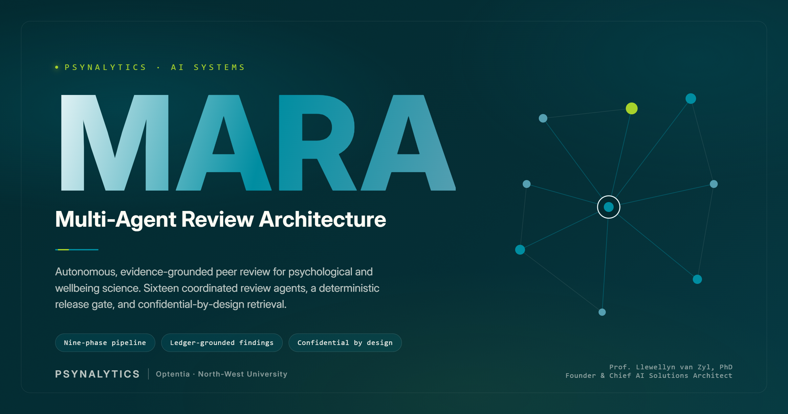

<div align="center">



<br>

**Autonomous, evidence-grounded peer review for psychological and wellbeing science.**

A Psynalytics AI system. Proprietary and confidential.

</div>

---

> **Proprietary software.** Copyright © 2026 Llewellyn van Zyl and Psynalytics B.V. All rights reserved. No licence to use, copy, modify, or distribute is granted. Commercial use is prohibited. See [LICENSE](LICENSE).

## Overview

MARA is a multi-agent system that reviews psychology and wellbeing-science manuscripts the way a rigorous, developmental third reviewer would. A single instruction runs a fully orchestrated pipeline that reads the manuscript, establishes its field context, audits its references, examines it through a fleet of specialist lenses, stress-tests the findings, and produces a developmental author letter, a confidential editor summary, and a full evidence-grounded review report.

The system rests on one discipline. Every claim in every deliverable traces to a specific finding in an append-only evidence ledger, anchored to a location in the manuscript. A recommendation that cannot be grounded does not ship. The reviewing voice stays developmental even when the verdict is severe, because a review is meant to show the path forward, not to close the door.

MARA runs entirely on one machine. The manuscript text, the author identities, the reviewer's findings, and the model-provider keys never leave it.

## What it does

| Capability | Detail |
|---|---|
| Full developmental review | A nine-phase pipeline from intake to branded deliverables, coordinated across sixteen review agents. |
| Evidence-grounded findings | Every finding carries a manuscript anchor and enters an append-only ledger. Claims in the letter map to ledger identifiers through a structured evidence map. |
| Deterministic release gate | A programmatic gate blocks release unless grounding, confidentiality, register, and structure invariants all hold. No agent certifies its own output. |
| Adversarial self-review | An independent critic runs after each major phase and again at the release gate, with a bounded budget for forcing corrections. |
| Confidential by design | Manuscript text and author identities never enter a public query. Only construct and method terms reach the literature search, behind an allowlisted, signed, n-gram-guarded egress. |
| Expert literature engagement | The review argues against named comparator works retrieved into a field dossier, calibrating the manuscript's claims against the field benchmark. |
| Integrity signals, never verdicts | Similarity, AI-content, figure, and reproducibility checks are surfaced as editor-only signals with mandatory caveats, never as accusations. |
| Branded deliverables | The author letter and editor summary render as Psynalytics-branded Word documents through a deterministic generator. |

## How it works

The pipeline moves through nine phases. Each writes to the shared evidence ledger, and the orchestrator is the only writer that merges fragments into the canonical record.

```
Phase 0   Sanitisation        Screen the manuscript for hidden instructions and tampering
Phase 1   Structured analysis Convert the manuscript into a structured review object
Phase 2   Field context       Retrieve comparator literature and audit every reference
Phase 3   Specialist review   Run each active lens as an independent first pass, then challenge
Phase 4   Integrity screen    Reporting, similarity, AI-content, figure, and reproducibility signals
Phase 5   Swarm stress-test   Test which findings are consensus-robust and force dissent to surface
Phase 6   Internal report     Assemble the full internal review report from the ledger
Phase 7   Release gate        Score the rubric, set the recommendation, write the letter, gate release
Phase 8   Deliverables        Render the branded Word documents and record the audit trail
```

The release gate at Phase 7 is deterministic. It rejects any deliverable whose prose carries a raw finding identifier, an internal machine token, a stock machine-writing tell, or a banned verdict term, and any evidence map that does not reconcile with the ledger and the manuscript. Failures route back for a bounded number of fix cycles, then to a logged arbitration. The reviewer's own preliminary assessment, when provided, is withheld from the review and stress-tested against the evidence only after the recommendation is set.

## Architecture

A TypeScript monorepo managed with pnpm.

```
app/               Next.js web application (intake, live run view, results, downloads)
server/            Review engine, worker, data layer, citation retrieval, security
  src/engine/        The nine-phase pipeline, release gate, grounding validator
  src/citations/     Reference verification and guarded topic search
  src/security/      Egress guard, encrypted provider-key vault
  src/worker/        Single-lease worker, queue, recovery
  src/data/          SQLite access, event stream, deliverables
packages/shared/   Zod schemas shared by the app, server, and agents
agents/            Sixteen agent definitions (method prompts and manifests)
knowledge/         The deduplicated knowledge base (governance, lenses, decision, voice, craft)
docker/            Container build and entrypoint
```

The runtime is a single container that runs the web application and the review worker together, backed by a local SQLite database in write-ahead-logging mode. Manuscript parsing uses GROBID when available and falls back to a built-in PDF reader. Model inference runs against one configured provider. Optional tracing is emitted to a local Langfuse instance.

**Stack:** TypeScript, Next.js, Node.js worker, better-sqlite3 with Drizzle migrations, Docker. **Providers:** Azure OpenAI, OpenAI, Anthropic, Google, or a local Ollama model.

## Quickstart

You need Docker and one model-provider key. From a clean clone, three steps take you to a running review.

**1. Create your environment file and set two values.**

```bash
cp .env.example .env
```

In `.env`, set:

- `MARA_MASTER_KEY` to a 32-byte key. Generate one with `openssl rand -hex 32`.
- Either the four `AZURE_*` values for Azure OpenAI, or a single provider key: `OPENAI_API_KEY`, `ANTHROPIC_API_KEY`, `GOOGLE_API_KEY`, or `OLLAMA_BASE_URL`.

**2. Start MARA.**

```bash
docker compose up -d
```

The first start builds the image, runs the database migrations, and starts the web application and the worker together. Confirm readiness with `docker compose ps`, where the `mara` service reports healthy.

**3. Open the application.**

Open `http://localhost:3100`. Upload a PDF or DOCX manuscript, answer the short set-up questions, and MARA runs the full review. Download the report and the editor summary from the results screen.

Stop MARA with `docker compose down`. Your data stays in `./data`.

## Configuration

All configuration is through environment variables. `.env.example` documents every option. The essentials:

| Variable | Purpose |
|---|---|
| `MARA_MASTER_KEY` | 32-byte key for the AES-256-GCM provider-key vault. Required to persist provider keys on disk. |
| `AZURE_*` or a provider key | One model provider. Azure uses certificate authentication. The others use a single API key. |
| `MARA_PORT` | Host port for the web application. Defaults to 3100. |
| `GROBID_URL` | Optional. Point at a GROBID service for higher-fidelity PDF parsing. |
| `LANGFUSE_*` | Optional. Emit run traces to a local Langfuse instance. |

Provider keys entered in the application for a single session are held in memory and never written to disk. Keys persisted through the settings screen are sealed with the master key.

### Higher-fidelity PDF parsing (optional)

The default image parses PDFs with a built-in fallback, so it works with no extra services. For richer reference and section extraction, enable the GROBID sidecar by setting `GROBID_URL=http://grobid:8070` in `.env` and starting with the profile:

```bash
docker compose --profile grobid up -d
```

GROBID needs roughly 4 GB of RAM on top of MARA. On a machine with 8 GB or less, prefer the default fallback parser.

### Tracing (optional)

If you run Langfuse on the host, set `LANGFUSE_HOST` (default `http://host.docker.internal:3000`), `LANGFUSE_PUBLIC_KEY`, and `LANGFUSE_SECRET_KEY`. When these are absent, MARA runs on its local statistics panel alone and tracing is skipped. A missing Langfuse is never an error.

## Development

```bash
pnpm install
pnpm -r typecheck              # type-check every package
pnpm -r test                  # run the full offline test suite
pnpm --filter server worker   # run the review worker against the local database
pnpm --filter @mara/app dev   # run the web application in development
```

The test suite is fully offline. It mocks every model dispatch, so it neither spends nor touches a provider. Database schema changes are generated with `pnpm db:generate` and applied automatically on worker and container start.

## Security and confidentiality

Confidentiality is a design constraint, not a setting.

- **The manuscript never leaves the host.** Author identities and unpublished results are never placed in a public query. The literature search sends construct and method terms only, behind an allowlisted, HMAC-signed egress with an eight-gram guard that blocks any query overlapping the manuscript.
- **Editor-only content stays editor-only.** Integrity signals, confidential synthesis, and the preliminary-assessment stress test never reach the author-facing letter or the read-only evidence endpoint.
- **Provider keys are protected.** Session keys are held in memory. Persisted keys are sealed with AES-256-GCM under a master key that is never committed.
- **The ledger is append-only.** Corrections supersede by new rows. History is preserved for audit.

Secret scanning runs over the full history with a documented allowlist for synthetic test fixtures. No credential is committed.

## The reviewing voice

MARA sits beside the author. Severity stays honest, and the wording stays developmental. A destructive letter fails the release gate no matter how correct its findings, and generic feedback that would fit any manuscript is treated as a defect. Integrity concerns are always framed as editorial signals for a handling editor to verify, never as determinations of misconduct.

## Author

Prof. Llewellyn van Zyl, PhD, is the Founder and Chief AI Solutions Architect at Psynalytics, and works within Optentia at North-West University. His work sits at the intersection of data science, positive psychology, and the governance of artificial intelligence systems.

MARA is developed and maintained by Psynalytics.

## Licence

Proprietary and confidential. Copyright © 2026 Llewellyn van Zyl and Psynalytics B.V. All rights reserved.

No right or licence to use, run, copy, modify, distribute, or exploit this software is granted. Commercial use is expressly prohibited. Any use requires a separate written agreement with the owner. See [LICENSE](LICENSE) for the full terms, and direct enquiries to hello@psynalytics.com.

## Disclaimer

MARA produces developmental, pre-submission editorial feedback. It is not affiliated with any journal, it is not a certification of quality, and it is not a substitute for human peer review. Every output is advisory and must be verified by a qualified person before any reliance.
